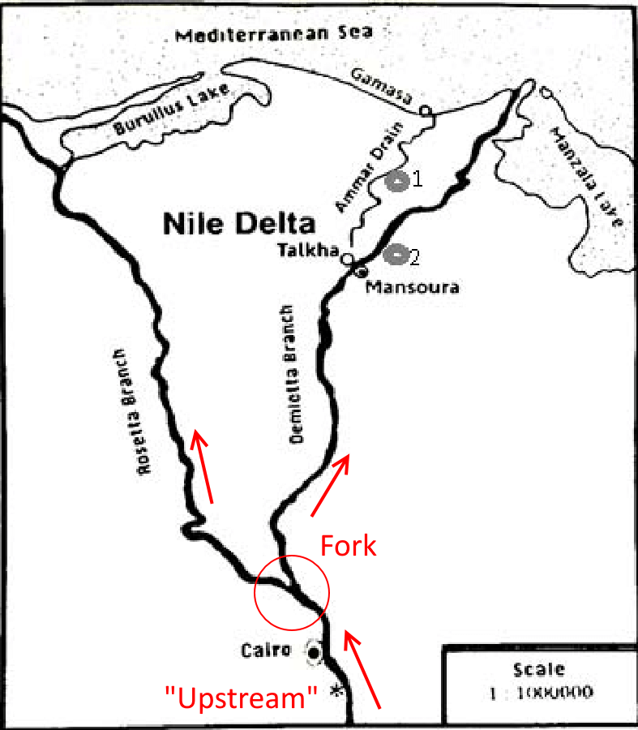

# ForkingExample
Fork this repo to see how Forking and Pull requests work in GitHub

1. Click the "Fork" button in the top right corner to create a copy of this repository on your personal GitHub account
2. If you look at the adress bar in your browser, and the title of the repository, you will see that you have now moved into a copy of the repository on your own GitHub page
3. Add a file to your fork of the repository on your personal GitHub page
4. Create a pull request to send your file to the original ("upstream") repository: 
  - click the `Pull requests` button under the name of the repository
  - click the green `New pull request` button
  - Make sure your fork is on the right-hand side, and the upstream repo on the left-hand side; the arrow indicates in which direction your changes need to flow. 
  - Click the green `Create pull request` button 
  - Provide a title and description for your pull request and click the button.

NB: the term "fork" does not refer to the eating utensil but to the imagery of a fork in a river, the place where a branch splits off from the main branch of a river: 

Most repositories will not be like the Nile but like the Upper Columbia river... 

